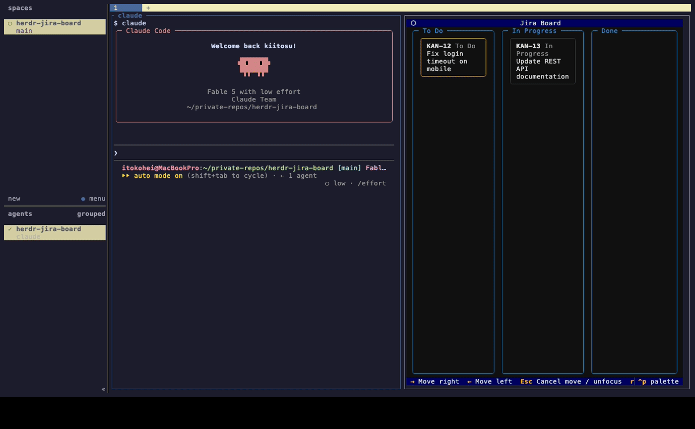

# herdr-jira-board

Jira のボードをカンバン TUI として [herdr](https://herdr.dev) 内に表示し、
カードから [Claude Code](https://claude.com/claude-code) セッションを起動できる
herdr プラグイン。セッションの状態バッジが看板上でライブ更新されます。

English version: [README.md](README.md)



## 機能

- JQL で取得した課題をステータスカテゴリ3列 (To Do / In Progress / Done) で表示
  — カスタムワークフローのプロジェクトが混在しても破綻しません。
  デフォルトでは「自分の未完了課題 + 直近7日以内に更新された完了課題」を表示し、
  古い完了カードは自動的に消えます（設定の `jql` で変更可能）
- カードは `←` `→` キーまたはドラッグ&ドロップで移動し、`Enter` で確定して
  Jira のトランジションを実行（候補が複数のときは選択ポップアップ）。
  仮移動は溜められるので、複数のカードを1枚ずつ動かしてまとめて確定できます。
  `t` で同一列内のもの（進行中 → 社内レビュー中 など）も含む全トランジション
  からステータスを変更できます
- カード上で `Enter` すると、その課題を担当する Claude Code セッションを
  新しい herdr タブに起動（`JIRA_ISSUE_KEY` と、サマリ・ステータス・期限・
  説明文・URL を含む初期プロンプトを注入）。
  ボードの相棒セッション（`c`）の記録を引き継ぐので、既に話していた内容から
  始められます（[詳細](#相棒セッション)）
- 複数ステータスが混在する列（主に In Progress）は、ステータスごとに区切り
  ラベルを入れてカードをグループ表示。並び順は設定 `status_order` で指定可能
- `herdr agent list` を5秒ごとにポーリングし、カードにセッション状態バッジ
  (working / blocked / idle / done) を表示
- カードに作成日と期限を表示（期限切れは赤、3日以内は黄）
- `bin/jira-board --dump` で同じ盤面を TUI なしのテキスト（または JSON）で出力。
  Claude Code から読ませるスキルも同梱 — [Claude からボードを読む](#claude-からボードを読む)
- タブ整理アクション（他のタブを閉じる / 右側のタブを閉じる）付き
- UI は英語 / 日本語対応 — システムロケールに追従し、設定で上書きも可能

## 必要なもの

- herdr >= 0.7.5 (macOS / Linux)
- Python 3.11+ **または** [uv](https://docs.astral.sh/uv/)
- Jira Cloud アカウントと API トークン

## インストール

```
herdr plugin install kiitosu/herdr-jira-board
```

これだけです。インストール時に Python 環境を自動で準備します
（uv があれば uv を、なければ専用の仮想環境を使います）。

## 設定

1. https://id.atlassian.com/manage-profile/security/api-tokens で API トークンを
   作成（「スコープ付き」ではなくクラシックな「API トークンを作成」を選択）。
2. [config.toml.example](config.toml.example) をプラグインの設定ディレクトリに
   コピーして編集:

```
cp config.toml.example "$(herdr plugin config-dir jira-board)/config.toml"
```

最小構成:

```toml
site = "https://your-site.atlassian.net"
email = "you@example.com"
api_token = "<API トークン>"
```

すべてのオプション（`api_token_cmd`, `jql`, `exclude_statuses`, `status_order`,
`language`, `[project_dirs]`）は `config.toml.example` のコメントを参照してください。

## 使い方

herdr 内で看板を開く:

```
herdr plugin pane open --plugin jira-board --entrypoint board
```

`~/.config/herdr/config.toml` にキーバインドを登録しておくと便利です:

```toml
[[keys.command]]
key = "prefix+k"
type = "plugin_action"
command = "jira-board.open-board"
description = "看板表示"

[[keys.command]]
key = "prefix+x"
type = "plugin_action"
command = "jira-board.close-right-tabs"
description = "右のタブを閉じる"

[[keys.command]]
key = "prefix+shift+x"
type = "plugin_action"
command = "jira-board.close-other-tabs"
description = "他のタブを閉じる"
```

### キー操作

| キー | 動作 |
| --- | --- |
| `↑` `↓` | 前 / 次のカードへフォーカス |
| `←` `→` | 隣の列へ仮移動 |
| `Enter` | 仮移動を全て確定、または Claude セッション起動 |
| `Esc` | 仮移動を全て取消 / 選択解除 |
| `r` | 看板を更新 |
| `o` | 課題をブラウザで開く |
| `t` | カードのステータスを変更（同一列内も含む全トランジションから選択） |
| `c` | 相棒セッションを隣に開く / そこへ移動 |
| `q` | 終了 |

マウスでカードを列間ドラッグすることもできます（同様に仮移動 → `Enter` で確定）。

仮移動はカードごとに溜まります。好きな枚数のカードを（それぞれ別の列へ）仮移動して
おき、`Enter` で順番にまとめて実行できます。トランジション候補が複数のカードは
順番が来たときに選択ポップアップが出ます。失敗したカードだけ元の列に戻り、
残りはそのまま実行されます。`←` `→` で元の列に戻せば、そのカードだけ確定対象から
外れます。

### 相棒セッション

`c` でボードの隣のペインに Claude Code セッションを開きます。相談しながら考える
ためのセッションで、実装はカードから起動する個別セッションが担当します。もう一度
`c` を押すとそのペインに移動します。

ボードは相棒の Claude セッションIDを記録するので、ペイン（やボード自身）を閉じた
後でも `c` で `claude --resume <session-id>` により**同じ会話が復帰**します。
Claude 側にもう無いセッション（何も話さないまま閉じた場合など）は、新規セッション
に差し替わります。

### 起動するセッションへの引き継ぎ

`Enter` でセッションを起動するとき、ボードは紐づいているセッション ——
相棒セッション（どのタブに居ても対象）と、ボードと同じ herdr タブにいる他の
Claude ペイン（`HERDR_TAB_ID` と `herdr pane list` で特定）—— の記録
（トランスクリプト）のパスを初期プロンプトに追記します。新しいセッションには
「課題キーで grep して該当部分だけ読め」と伝えるので、既に詰めた内容を打ち直さずに
引き継げます。

トランスクリプトはセッションIDで
`${CLAUDE_CONFIG_DIR:-~/.claude}/projects/*/<session-id>.jsonl` から探します。
まだ記録の無いセッション（何も話していないもの）は対象外で、紐づくセッションが
無ければ初期プロンプトは従来どおりです。

## Claude からボードを読む

`--dump` は TUI を開かず、看板と同じ設定・JQL・除外・列分類で盤面をテキスト出力します。

```
bin/jira-board --dump          # テキスト
bin/jira-board --dump --json   # 機械可読
```

Jira MCP でボード全件を取ると各課題の description まで返ってきて応答が肥大するため、
Claude Code セッションからボードを把握する手段としてはこちらを使います。

これを呼ぶ Claude Code スキルを `skills/jira-board` に同梱しています。既定では
インストールされません。環境変数を付けると `~/.claude/skills` へコピーします
（`CLAUDE_CONFIG_DIR` があればそちらを優先）。

```
HERDR_JIRA_BOARD_INSTALL_SKILL=1 herdr plugin install kiitosu/herdr-jira-board
# インストール済みならビルド手順だけ再実行:
HERDR_JIRA_BOARD_INSTALL_SKILL=1 bin/setup
```

以後 Claude は「ボードの状況を確認して」等で自動的にこのスキルを使い、dump を実行します。
書き込むのは `~/.claude/skills/jira-board` だけで、そこに本プラグイン以外が作った
ディレクトリがある場合は何もしません。

コピーされたスキルは実行時にプラグインの場所を自力で解決するため、プラグイン更新後も
そのまま動きます。プラグインを通常と異なる場所に置いている場合は
`HERDR_JIRA_BOARD_ROOT` で明示してください。

## 開発

```
git clone https://github.com/kiitosu/herdr-jira-board
herdr plugin link herdr-jira-board   # 編集が即時反映されます
```

TUI を開かず設定だけ確認: `bin/jira-board --check`  
TUI を開かず盤面を確認: `bin/jira-board --dump`

テスト実行:

```
uv run --with "textual>=0.80" --with "httpx>=0.27" --with pytest --with pytest-asyncio -m pytest tests/
```

## ライセンス

[MIT](LICENSE)
